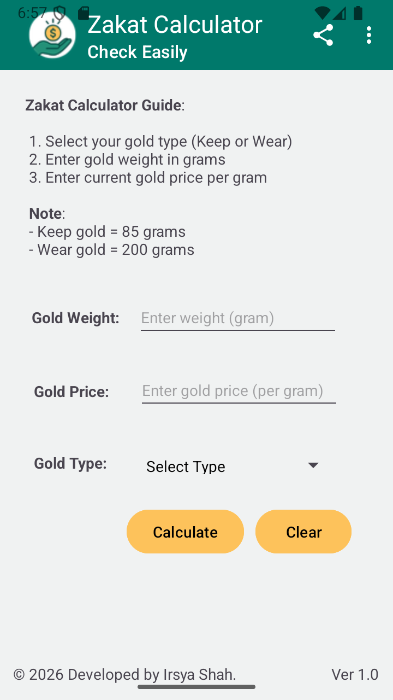
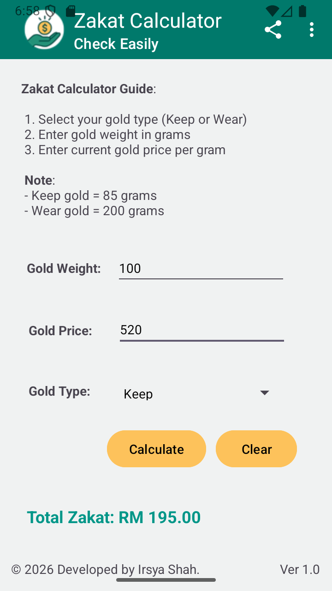

# Zakat Calculator App

## Description
This is a simple Android application that calculates gold zakat.  
Users can enter gold weight, gold price and select type (keep or wear) to calculate zakat amount.

## Features
- Calculate gold zakat
- Input validation
- Share app feature
- About page

### Main Screen

### Result Output

### About Screen

## How it works
1. Enter gold weight
2. Enter gold price
3. Select type (keep or wear)
4. Click calculate to get zakat result

## Language & Tools
- Java
- Android Studio
